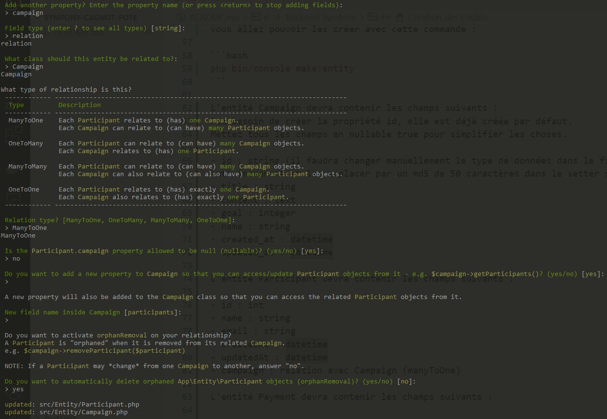

# 💰 TP d'apprentissage Payetonpote

Vous allez créer un projet de paiement collaboratif. Ce sera une preuve de concept pour un site de type leetchi, mais pourquoi pas aussi pour des paris entre potes, des courses communes, etc.

**Analyse des besoins :**

- **En tant qu'utilisateur**, je crée une campagne de financement collaborative avec les champs suivants :

  - _Nom de la campagne_ : 120 caractères maximum
  - _Contenu de la campagne_ : texte libre via [éditeur markdown](https://simplemde.com/)
  - _Objectif de cagnotte_ : nombre qui servira de simple indicateur
  - _Nom_
  - _Email_

- **En tant qu'utilisateur**, j'accède à une campagne partagée par l'auteur de la campagne via URL sécurisée et aléatoire.

- **En tant que participant**, je peux payer n'importe quel montant. En plus de ma carte, je suis invité à saisir mon email. Le paiement est ensuite comptabilisé dans la cagnotte et visible dans une liste.

**Note importante :** Il y aura une limitation majeure : le destinataire des paiements ne sera pas dynamique : ce sera une seule personne pour toute l'application. Après avoir réussi à terminer ce projet, il serait possible de le continuer avec un système qui relie les créateurs de campagnes avec leur compte bancaire. Mais nous n'irons pas jusque-là dans un premier temps.

**Lexique :**

- **Utilisateur :** Un visiteur ayant accès à la page d'accueil.

- **Participant :** Un utilisateur qui participe à une campagne. Participer à une campagne signifie avoir effectué un paiement.

- **Campagne :** Un projet de financement créé dans l'application.

- **Cagnotte :** La tirelire commune calculée en fonction des paiements et dépenses de chacun.

- **Objectif de cagnotte :** Nombre indicatif qui n'a aucun effet.

# ✨ Backend Symfony

Vous avez commencé l’intégration du front-end de l’application dans le mini-tp de la maquette, nous allons maintenant développer les fonctionnalités dans le backend PHP.

## 👉 Préparer la base de données

Premierement, nous devons relié notre application à une base de données. Nous allons en créer une nomé "payetonpote" dans notre PHPMyAdmin. PAS BESOIN DE CREER DE TABLES, SYMFONY S'EN CHARGERAS !
Votre projet Symfony contient un fichier .env qui regroupe toutes les variables d'environnement de votre projet. Vous devrez modifier la variable DATABASE_URL pour qu'elle corresponde à votre base de données.

```env
DATABASE_URL="mysql://root:@localhost:3306/payetonpote"
```

mysql est le driver de la base de données, root est le nom d'utilisateur, localhost ou 127.0.0.1 est le serveur, 3306 est le port et payetonpote est le nom de la base de données.

[📚 Documentation Symfony sur la configuration de la base de données](https://symfony.com/doc/current/doctrine.html)

## 🧙‍♂️ Création des Entités

Ce projet va nécessiter la création de trois entités : Campaign, Participant et Payment . Grâce à la console de Symfony, vous allez pouvoir les créer avec cette commande :

```bash
php bin/console make:entity
```

L'entité Campaign devra contenir les champs suivants :
Pas besoin de créer la propriété id, elle est déjà créée par défaut.
Mettez tous les champs en nullable true pour simplifier les choses.

- id : string (il faudra changer manuellement le type de données dans le fichier Entity\Campaign.php, enlever le auto-increment et le remplacer par un md5 de 50 caractères dans le setter setId())
- title : string
- content : text
- goal : integer
- name : string
- created_at : datetime
- updated_at : datetime

L'entité Participant devra contenir les champs suivants :

- id : int
- name : string
- email : string
- createdAt : datetime
- updatedAt : datetime
- campaign : relation avec Campaign (manyToOne)

L'entité Payment devra contenir les champs suivants :

- id : int
- amount : float
- createdAt : datetime
- updatedAt : datetime
- participant : relation avec Participant (manyToOne)

Commencez par créer l'entité Campaign, c'est la plus simple. Vous remarquerez un type de données étrange pour le participant, c'est un type de données qui n'existe pas dans PHP, c'est un type de données propre à Doctrine, le ORM de Symfony. Il s'agit d'une relation entre deux entités, ici, une campagne peut avoir plusieurs participants.

Voici un exemple pour l'entité participant :



## 📦 Migration des entités vers la base de données

Une fois les entités créées, il faut les migrer vers la base de données. Pour cela, vous allez utiliser la commande suivante :

```bash
php bin/console make:migration
```

Cette commande va créer un fichier de migration dans le dossier `migrations` de votre projet. Vous pouvez voir le contenu de ce fichier pour comprendre ce que fait Symfony pour vous. Ensuite, vous allez exécuter la migration avec la commande suivante :

```bash
php bin/console doctrine:migrations:migrate
```

Cette commande va exécuter le fichier de migration et créer les tables dans votre base de données.

[📚 Documentation Symfony sur les migrations](https://symfony.com/doc/current/doctrine.html#migrations-creating-the-database-tables-schema)

## 🎛 Création des controllers

Vous pensez que Symfony, c'est déjà magique ? Ce n'est pas fini ! Nous allons désormais créer en une seule ligne de commande le Controller d'un Model, toutes les principales fonctions (C.R.U.D. Create, Read, Update, Delete) ainsi que les Views (templates) associés à ces méthodes !

```bash
php bin/console make:crud
```

La console vous demandera l’entité souhaitée, vous choisirez Campaign. Et vous
nommerez le controller associé avec le même nom.

**Attention :** ne faites que le CRUD de Campaign pour le moment.

Prenez le temps d'étudier tout le code que vous avez généré... c'est bon, vous avez tout
compris ? (non, c'est normal, ne pas hesiter à poser des questions !) Vous avez maintenant
un CRUD complet pour votre entité Campaign.

vous pouvez également parcourir les vue générées dans le dossier templates/campaign.

# 🎨 Réorganisation de l'intégration

Dans cette étape, nous allons utiliser le `CampaignController` que vous venez de créer
pour réorganiser les pages de la maquette dans le projet Symfony. nous n'aurons pas besoin de la page index dans le dossier templates/campaign (nous utiliserons la page index de la maquette). pas besoin non plus de la page delete (disons que nous ne voulons pas que les utilisateurs suppriment des campagnes).

la page show.html.twig du dossier templates/home sera déplacée dans le dossier templates/campaign et il faudra adapter le controller et la vue pour qu'elle fonctionne comme la page show qu'a généré le CRUD de symfony.

Pour ce qui est de la page new.html.twig, elle correspond à la page create de la maquette. Mais les formulaires de symfony sont très différents des formulaires en html classique. Nous allons voir comment les utiliser dans la prochaine étape.

## Les Formulaires Symfony

### Une chose importante à savoir : Les formulaires de Symfony sont eux aussi des objets à part entière !

Lors de la création du CRUD de campaign, un fichier `CampaignType.php` à été créé dans le
dossier Form de `src`.

Lors de l'affichage de la view `new.html.twig`, une variable contenant le formulaire a été envoyé
depuis le controller !

```php
// src/Controller/CampaignController.php

    #[Route('/new', name: 'app_campaign_new', methods: ['GET', 'POST'])]
    public function new(Request $request, EntityManagerInterface $entityManager): Response
    {
        $campaign = new Campaign();
        $form = $this->createForm(CampaignType::class, $campaign); //<<<---- ICI !
        $form->handleRequest($request);

        if ($form->isSubmitted() && $form->isValid()) {
            $entityManager->persist($campaign);
            $entityManager->flush();
            return $this->redirectToRoute('app_campaign_index', [], Response::HTTP_SEE_OTHER);
        }

        return $this->render('campaign/new.html.twig', [
            'campaign' => $campaign,
            'form' => $form, //<<<---- ET LA !
        ]);
    }
```

Cette variable contient une instance de CampaignType fait avec la méthode de symfony `createForm()` ainsi que l'objet Campaign, pret à être rempli.

Cette variable $form est utilisée ici, dans le include de `_form.html.twig`.

```twig

    <h1>Create new Campaign</h1>
    {{ include('campaign/_form.html.twig') }}
    <a href="{{ path('app_campaign_index') }}">back to list</a>

```

Le formulaire ressemble à ceci pour l'instant :

```twig
{{ form_start(form) }}
    {{ form_widget(form) }}
    <button class="btn">{{ button_label|default('Save') }}</button>
{{ form_end(form) }}
```

form_start et form_end sont des fonctions de twig qui génèrent les balises form de html. form_widget génère les champs du formulaire en fonction du FormType qui a été créé dans le controller.

CampaignType a été généré automatiquement pour remplir toutes les colonnes de votre table. il
va falloir le modifier pour enlever les champs que l'on ne souhaite pas remplir comme
`updated_at` et `created_at`.

```php
public function buildForm(FormBuilderInterface $builder, array $options): void
{
    $builder
        ->add('title')
        ->add('content')
        ->add('createdAt') // A RETIRER
        ->add('updatedAt') // A RETIRER
        ->add('goal')
        ->add('name')
    ;
}
```

Ce "Formbuilder" est la pour générer un objet à partir des champs du formulaire, ce qui nous
permettra de les valider ou de spécifier des caractéristiques comme des longueurs maximales de
champs.

À savoir que nous ne sommes pas obligés d'utiliser le la syntax {{ form_start(form) }} et {{ form_widget(form) }}, nous pouvons écrire le formulaire en html classique, mais il est indispensable d'utiliser la gestion des formulaires de symfony. Sinon vous ne pourrez utiliser les méthodes de validation de symfony et le handleRequest.

```twig
<form method="post">
    {{ form_row(form.title) }}
    {{ form_row(form.content) }}
    {{ form_row(form.goal) }}
    {{ form_row(form.name) }}
    <button class="btn">{{ button_label|default('Save') }}</button>
</form>
```

vous pouvez ajouter des attributs html à vos champs de formulaire en utilisant la méthode `attr` dans le `CampaignType`:

```php
public function buildForm(FormBuilderInterface $builder, array $options): void
{
    $builder
        ->add('title', null, [
            'attr' => ['class' => 'form-control']
        ])
        ->add('content', null, [
            'attr' => ['class' => 'form-control']
        ])
        ->add('goal', null, [
            'attr' => ['class' => 'form-control']
        ])
        ->add('name', null, [
            'attr' => ['class' => 'form-control']
        ])
    ;
}
```

# 🕵️‍♂️ Le code Métier

Les bases du projet sont prêtes, nous allons maintenant développer les fonctionnalités !

## Modification de l'Entity Campaign

L'enregistrement de la campagne est pour le moment autoincrémenté, nous allons changer cela pour que l'id soit généré automatiquement à la création de la campagne avec un md5 de 50 caractères. Nous devons modifier les annotations de la propriété id dans le fichier Entity\Campaign.php.

**Attention :** il faut modifier votre table dans la base de données pour que la colonne id soit de type string et non plus de type int, ainsi que de lui enlever l'auto-increment.

- On souhaite nous même assigner la propriété ID (au lieu de l'auto-increment habituellement utilisé)
- La colonne `id` ne possède pas de setter par défaut, nous devons en créer un pour pouvoir assigner un id à la campagne.

```php
#[Id]
#[Column(name: "id", type: "string", length: 32, nullable: false)]
#[GeneratedValue(strategy: "NONE")]
private string $id;

public function setCustomId(): self
{
    $id = md5(random_bytes(50));
    $this->id = $id;
    return $this;
}
```

## Modification de CampaignController et de la méthode new

Dans la méthode new, nous devons appeler la méthode setCustomId() de l'entité Campaign pour lui assigner un id.

```php
if ($form->isSubmitted() && $form->isValid()) {
    $campaign->setCustomId(); //il faut définir l'id de la campagne !
    $entityManager->persist($campaign);
    $entityManager->flush();

    return $this->redirectToRoute('app_campaign_index', [], Response::HTTP_SEE_OTHER);
}
```

Et voilà, vous avez maintenant une campagne avec un id unique et aléatoire dans votre base de données ! Le tutoriel pas à pas est terminé, vous devrez maintenant développer les fonctionnalités suivantes :

# 🎮 A vous de jouer

## 🤷 Création de la fonction Payment

Vous allez devoir créer le controller PaymentController qui gerera la création d'un paiement et d'un participant en même temps.

vous pouvez utiliser la commande du CRUD mais seul la méthode new devra être conservée.
Supprimez également les vues inutiles.

Verifier le FormType de Payment qui doit inclure le FormType de Participant (qui n'existe pas encore, à vous de le créer).

Cette fonction devra se faire en plusieurs étapes :

- Création et injection du FormType de paiement mixé avec le formulaire du participant.
- Récupération du montant du paiement.
- Instanciation la campagne.
- Enregistrement du participant.
- Enregistrement du paiement.
- Redirection vers le show de la campagne.

## 🏄 Dynamiser les templates

Maintenant que vous savez enregistrer un paiement, il va falloir changer toutes les données en
dure dans les templates :

- La barre de progression doit correspondre au pourcentage de complétion de l'objectif de la campagne.
- Le nombre de participants.
- Le montant total récolté pour une campagne.
- La liste des participants avec leur participation.

## 🕵 Fonctionnalités d'anonymat

Les utilisateurs du projet doivent désormais avoir la possibilité de ne pas afficher leur identité ou
le montant de leur paiement s'ils cochent les champs correspondants

- Ces ajouts de fonctionnalités impliquent de faire des modifications dans la base de données.

## 💸 Fonctionnalités de paiement

- Il n'est pas possible d'enregistrer un paiement négatif
- Si un paiement dépasse le goal de la campagne, il n'est plus possible de participer
